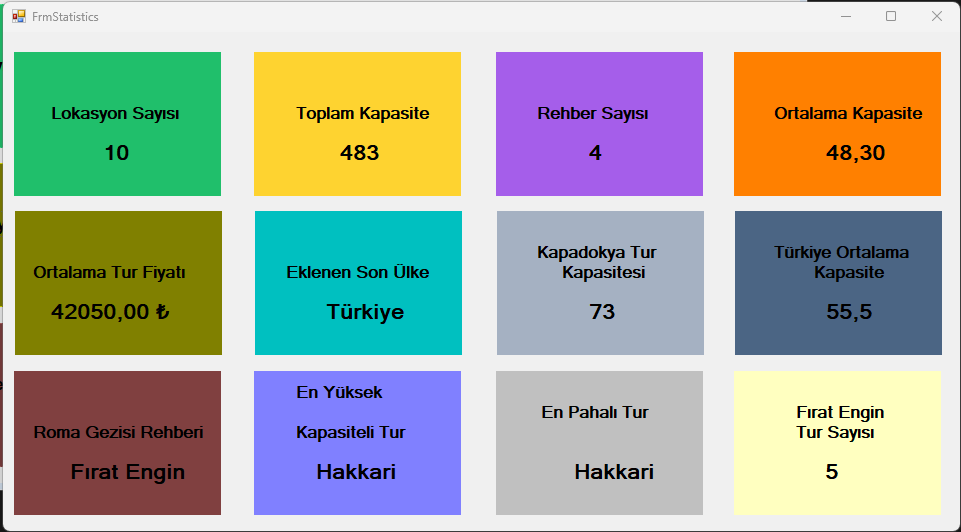

### 🌍 **Turizm İstatistikleri Paneli**  

Bu proje, **turizm verilerini analiz eden bir istatistik panelidir.** 📊 Form yüklendiğinde veritabanından çekilen bilgiler, **konumlar, rehberler ve fiyatlandırmalar** gibi çeşitli alanlarda analiz edilerek ekrana yansıtılır.  

### 🚀 **Öne Çıkan Özellikler:**  
✅ **Genel İstatistikler:** Toplam konum ve rehber sayısı, toplam kapasite bilgileri  
✅ **Ortalama Değerler:** Konumların ortalama kapasite ve fiyat hesaplamaları (**₺** simgesiyle)  
✅ **Özel Sorgular:**  
   - En son eklenen konumun ülkesi  
   - Kapadokya’nın kapasite bilgisi  
   - Türkiye’deki konumların ortalama kapasitesi  
✅ **Rehber Analizleri:**  
   - Roma’daki rehberin adı ve soyadı  
   - "Fırat Engin" isimli rehberin çalıştığı konum sayısı  
✅ **Maksimum Değerler:**  
   - En fazla kapasiteye sahip şehir  
   - En pahalı şehir  

📌 **Bu panel, turizm sektöründeki önemli verileri analiz ederek yöneticilere hızlı ve doğru bilgiler sunar.** 🚀
